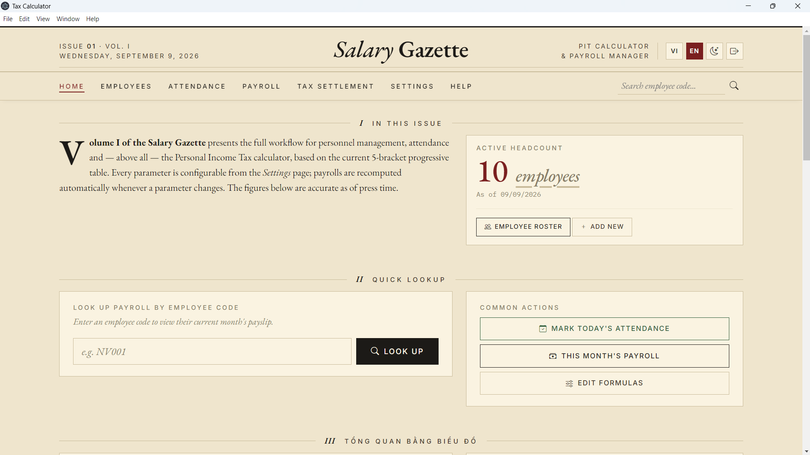
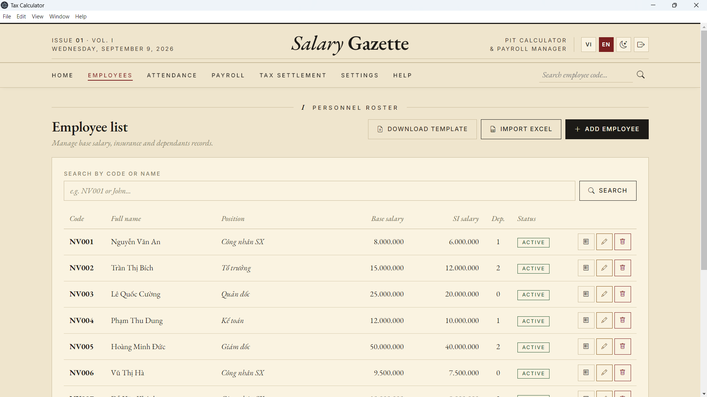
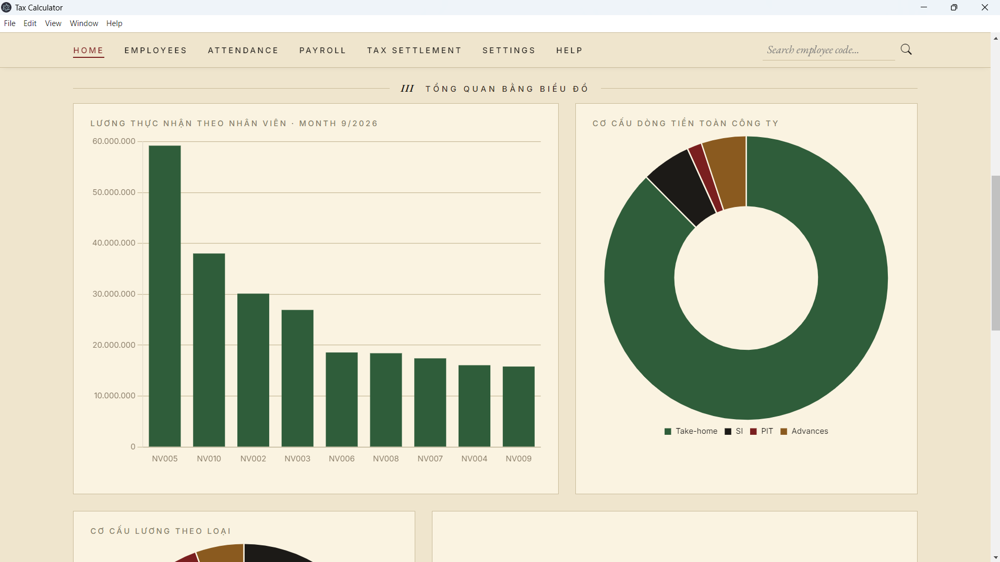
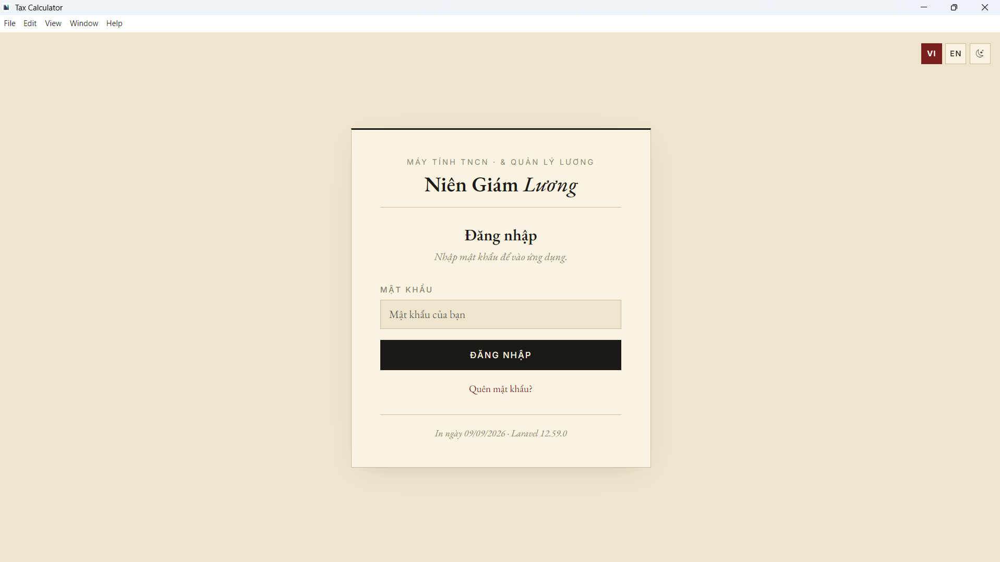

# Niên Giám Lương — Payroll & Personal Income Tax

<samp>[Tiếng Việt](README.md) · **English**</samp>

A payroll and personal income tax system for Vietnamese companies. It tracks
attendance, overtime, piece-rate work, allowances and advances, computes
progressive income tax and social insurance, and produces payslips that match
the paper form the company already used.

Built with **Laravel 12 / PHP 8.3** on **MySQL**. Runs as a web app, or as a
standalone Windows desktop application via **NativePHP / Electron** — no PHP,
MySQL or web server needed on the user's machine.

> Sole developer, May – June 2026. In production use.

---

## Why this isn't a CRUD demo

Three requirements shaped almost every design decision:

**1 · The tax law changes, and I won't always be here to redeploy.**
None of the statutory numbers live in the source. The five progressive brackets,
the personal and dependent deductions, the social insurance rate, standard
working days, the Sunday and overtime multipliers — all of it is stored in a
`settings` table and edited through `/settings`. When a figure changes, an
accountant updates it. Nobody touches PHP.

The shipped defaults, all editable:

| Monthly assessable income | Rate | Quick deduction |
|---|---:|---:|
| up to 10,000,000 ₫ | 5% | — |
| up to 30,000,000 ₫ | 10% | 500,000 ₫ |
| up to 60,000,000 ₫ | 20% | 3,500,000 ₫ |
| up to 100,000,000 ₫ | 30% | 9,500,000 ₫ |
| above 100,000,000 ₫ | 35% | 14,500,000 ₫ |

Applied after an 11,000,000 ₫ personal deduction, 4,400,000 ₫ per dependent, and
10.5% social insurance. See [`app/Services/TaxService.php`](app/Services/TaxService.php)
and [`app/Services/SettingService.php`](app/Services/SettingService.php).

**2 · A raise in June must not rewrite May.**
Salary is effective-dated. Each employee carries a history of salary changes with
an effective month. Payrolls for months before that date keep the old rate;
payrolls from the effective month onward are invalidated and recalculated on next
view. Historical pay records cannot be retroactively corrupted by a later edit.
See [`app/Models/SalaryChange.php`](app/Models/SalaryChange.php) and
[`app/Services/PayrollService.php`](app/Services/PayrollService.php).

**3 · Refreshing a page must never change the books.**
Every `GET` route in this application is strictly read-only. Anything that
persists is a separate `POST`. This is enforced by a test that walks each `GET`
endpoint and asserts the database did not move —
[`tests/Feature/ReadOnlyGetTest.php`](tests/Feature/ReadOnlyGetTest.php).
Payroll recomputation is an explicit action, not a side effect of looking at a
page.

---

## Architecture

```
app/
├── Models/            12 Eloquent models — Employee, Attendance, Overtime,
│                      Payroll, SalaryChange, Allowance, Advance, Leave, Setting…
├── Services/          business logic, kept out of controllers
│   ├── PayrollService.php      monthly computation (the largest piece)
│   ├── TaxService.php          progressive PIT + deductions
│   ├── SettlementService.php   year-end reconciliation
│   ├── SettingService.php      typed access to the settings table
│   └── AuthGate.php            password + recovery code
├── Http/
│   ├── Controllers/   11 controllers, kept thin
│   └── Middleware/    RequirePassword — the single access gate
database/migrations/   19 ordered migrations
resources/views/       Blade templates (~5,800 lines)
lang/                  vi.json · en.json — full bilingual UI
tests/                 PHPUnit — 31 feature tests
```

**Scale:** ~5,300 lines of PHP, ~5,800 lines of Blade, 19 migrations, 31 tests.

---

## Engineering decisions worth a look

**Excel import that asks before it overwrites.** Bulk employee import accepts
`.xlsx`, `.xls` and `.csv`. On a duplicate employee code the app renders a
field-by-field old ↔ new comparison and lets the user keep or replace each
record. Column headers resolve whether they arrive as Vietnamese with diacritics
or as `snake_case` — `Mã NV`, `ma_nv` and `employee_code` all map to the same
field. A "download template" action generates a correctly-shaped blank workbook.
→ [`app/Http/Controllers/EmployeeController.php`](app/Http/Controllers/EmployeeController.php)

**SPA behaviour without an SPA.** Create/edit/delete forms are intercepted with
`fetch`; the server replies with JSON, and a corner toast replaces the page
reload. The payslip page soft-reloads by re-fetching its own HTML and swapping
`<main>`, so totals update without a flash. No frontend framework — the whole
interaction layer is vanilla JavaScript in Blade.

**PDF generation with no PDF library.** Output is produced by `@media print`
rules and the browser's own *Save as PDF*. The individual payslip prints as a
compact single-page A4 reproducing the company's existing paper form; the
monthly attendance grid prints A4 landscape in Excel-style black and white.
Print routes are reachable from an external browser through HMAC-signed URLs,
because the desktop shell opens them via `Shell::openExternal` with no session
cookie — see the signature check in
[`app/Http/Middleware/RequirePassword.php`](app/Http/Middleware/RequirePassword.php).

**A door, not a user system.** This is single-company internal software, so it
has one password rather than accounts: bcrypt-hashed into the `settings` table
(no extra migration), with a one-time `XXXX-XXXX-XXXX-XXXX` recovery code shown
exactly once at setup. Sessions expire when the browser closes. Login is
rate-limited to 5 attempts per minute, recovery to 3 per five minutes.

**Genuinely bilingual.** Vietnamese and English across every page through
Laravel's `__()` helper — including the display labels of configuration rows
stored in the database. The active language lives in the session and persists
across pages.

**Attendance that reflects how the factory actually works.** Five daily states —
normal, half-day, Sunday (paid ×2), paid leave, unpaid leave. A half-day pays an
extra ½ diligence bonus per occurrence without forfeiting the month-end bonus;
an unpaid absence forfeits it. These rules came from the payroll clerk, not from
me, and the tests encode them.

---

## Screenshots

The application in production use at a Vietnamese manufacturing company.


*Home — issue masthead, headcount and quick lookup*

| | |
|---|---|
| <br>*Employee roster — Excel import with template download* | <br>*Take-home pay, insurance, tax and advances at a glance* |
| <br>*Password gate — bcrypt, one-time recovery code, rate limited* |  |

---

## Running it

**Requirements:** PHP ≥ 8.3, MySQL ≥ 5.7, Composer ≥ 2.2. Node.js ≥ 22 only if
you want to build the desktop app.

```bash
composer install
cp .env.example .env
php artisan key:generate
```

Create a database named `tax_calculator` with `utf8mb4_unicode_ci`, point `.env`
at it, then:

```bash
php artisan migrate --seed
php artisan serve
```

Open <http://localhost:8000>. The first visit redirects to `/auth/setup` to
create a password and issue a recovery code — **save the recovery code, it is
shown only once.**

The seed generates 10 employees across varied roles, two months of attendance
covering all five states, overtime, piece-rate pay, allowances and advances —
roughly 450 attendance records — so every feature has realistic data to exercise.

On Windows, `start.bat` does all of the above in one double-click.

### Tests

```bash
php artisan test
```

### Desktop build

Packaged with NativePHP/Electron into a self-contained folder that needs no PHP,
MySQL or web server on the target machine. See the Vietnamese README for the
full build procedure.

---

## Known limitations

- Single-tenant by design — one company per installation.
- One shared password rather than per-user accounts, so there is no audit trail
  of who changed what. Appropriate for the deployment it was built for, and the
  first thing I would change for a multi-user client.
- Tax rules are Vietnam-specific, though the bracket engine itself is generic.

---

*Author: Dat Luan Lu.*
